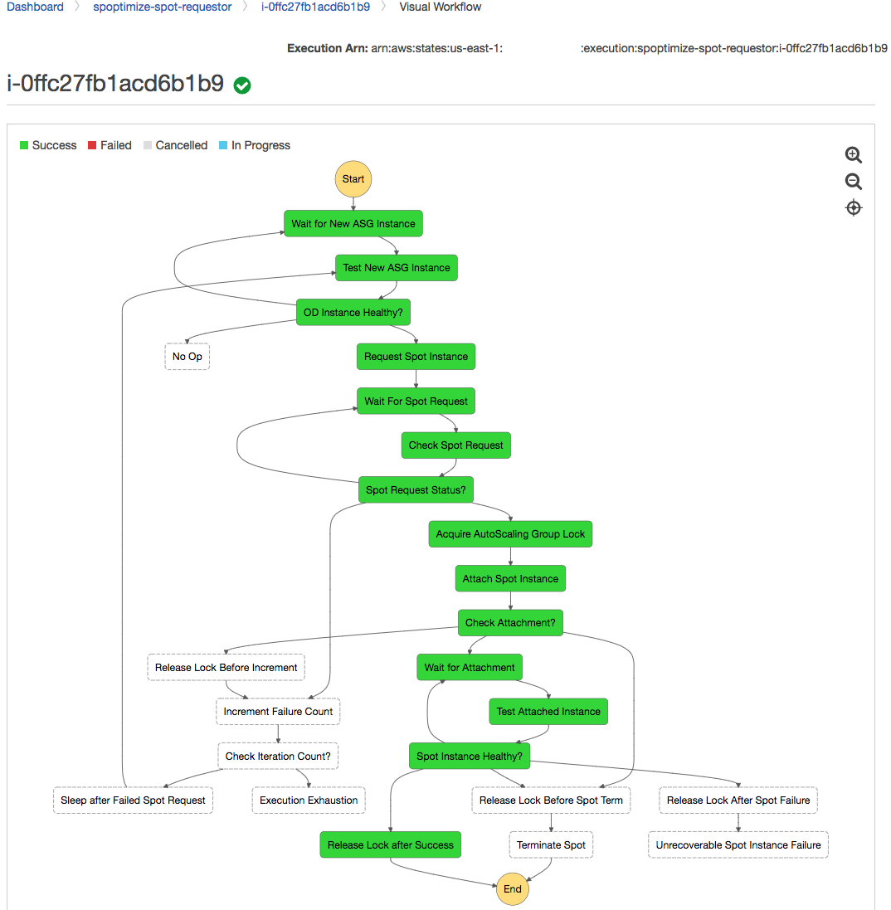
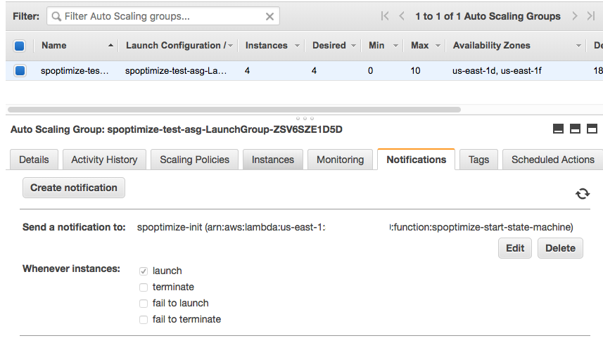
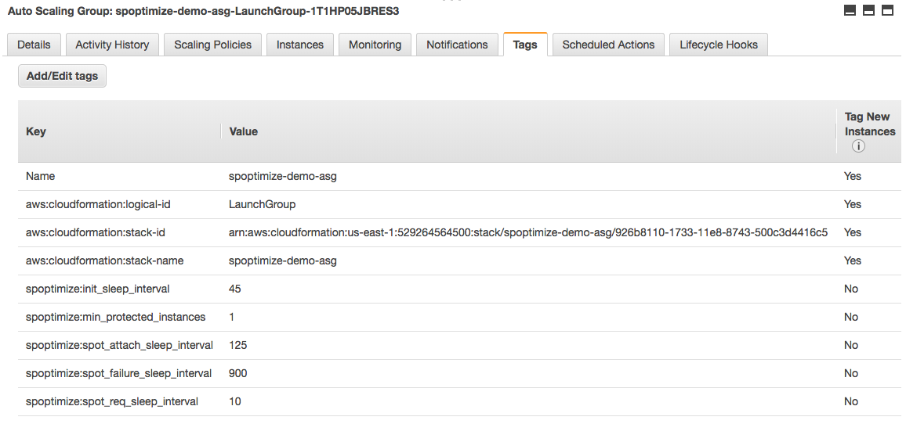

# **SPO**_P_**T**_IMIZE_

[](https://console.aws.amazon.com/codebuild/home?region=us-east-1#/projects/spoptimize/view)
[](https://coveralls.io/github/vrivellino/spoptimize)

Spoptimize is a tool that automates use of [Amazon EC2 spot instances](https://aws.amazon.com/ec2/spot/) in
your [AutoScaling Groups](https://aws.amazon.com/ec2/autoscaling/).

## About Spoptimize

Spoptimize was inspired by [AutoSpotting](https://github.com/cristim/autospotting), performs very similar
actions, but has its own - completely unique - implementation.

_But why reinvent the wheel and not use AutoSpotting?_

I had been noodling on ways to utilize spot instances in AutoScaling groups for quite awhile. Before writing
Spoptimize, I had brainstormed a few different ideas before I came across AutoSpotting. I thought the idea was
ingenious, but I thought it might be fun to build a similar system that was event driven vs using polling. I
had never used [AWS Step Functions](https://aws.amazon.com/step-functions/) before, so I took the opportunity
to build my own tool using Step Functions whose executions were initiated by [AutoScaling Launch Notifications](https://docs.aws.amazon.com/autoscaling/ec2/userguide/ASGettingNotifications.html).

## How it works

Each launch notification is processed by a Lambda, which in turns begins an execution of Spoptimize's Step
Funcions.

The Step Function execution manages the execution of Lambda functions which perform these actions:
1. Wait following new instance launch. (See `spoptimize:init_sleep_interval` [below](#configuration-overrides))
1. Verify that the new on-demand instance is healthy according to autoscaling.
1. Request Spot Instance using specifications defined in autoscaling group's launch configuration.
1. Wait for Spot Request to be fulfilled and for spot instance to be online. (See
   `spoptimize:spot_req_sleep_interval` [below](#configuration-overrides))
1. Acquire an exclusive lock on the autoscaling group. This step prevents multiple executions from attaching &
   terminating instances simultaneously.
1. Attach spot instance to autoscaling group and terminate original on-demand instance.
1. Wait for spot instance to be healthy according to autoscaling. (See `spoptimize:spot_attach_sleep_interval`
   [below](#configuration-overrides))
1. Verify health of spot instance and release exclusive lock.

Screenshot of a successful execution:


## Deploying

Here's a breakdown the privileges required for deployment. Deployment requires the ability to:
  - create/update/delete:
    - CloudFormation stacks
    - IAM Managed Policy 
    - IAM Roles
    - CloudWatch Alarms
    - DynamoDb tables whose table names begin with `spoptimize`
    - Lambda functions whose function names begin with `spoptimize`
    - Step Functions whose names begin with `spoptimize`
  - create a SNS topic named `spoptimize-init`
  - create a S3 bucket named `spoptimize-artifacts-YOUR_AWS_ACCOUNT_ID`
  - read/write to aforementioned S3 bucket with a prefix of `spoptimize`

Note: many of the names and prefixes can be overridden via setting environment variables prior to running the
deployment script.

### Quick Launch

You can deploy Spoptimize via the CloudFormation console using the following launch button. It will deploy the
latest build:

[](https://console.aws.amazon.com/cloudformation/home?region=us-east-1#/stacks/new?stackName=spoptimize&templateURL=https://s3.amazonaws.com/spoptimize-artifacts/public/latest/spoptimize.yml)

### Deployment Script

If you wish to deploy Spoptimize via a shell or an automated process, you can utilize the included deploy
script.

*Prerequisites*:
- Bash
- [AWS CLI](https://aws.amazon.com/cli/)
- API access to an AWS account

First clone this repo, or download a tar.gz or zip from [Releases](https://github.com/vrivellino/spoptimize/releases).

Deploy both the IAM stack and the Step Functions & Lambdas:

    $ ./deploy.sh

Deploy just the IAM stack:

    $ ./deploy.sh iam

Deploy just the Step Functions and Lambdas:

    $ ./deploy.sh cfn

## Configuration

After Spoptimize is deployed, configure your autoscaling groups to send launch notifications to the
`spoptimize-init` SNS topic.

Set via CloudFormation (see `NotificationConfigurations`):

```yaml
  LaunchGroup:
    Type: AWS::AutoScaling::AutoScalingGroup
    Properties:
      LaunchConfigurationName: !Ref LaunchConfig
      DesiredCapacity: 0
      MinSize: 0
      MaxSize: 12
      VPCZoneIdentifier: 
        - !Select [ 0, !Ref SubnetIds ]
        - !Select [ 1, !Ref SubnetIds ]
      MetricsCollection: 
        - Granularity: 1Minute
      HealthCheckGracePeriod: 120
      Cooldown: 180
      HealthCheckType: ELB
      TargetGroupARNs:
        - !Ref ElbTargetGroup
      Tags:
        - Key: Name
          Value: !Ref AWS::StackName
          PropagateAtLaunch: true
      NotificationConfigurations:
        - TopicARN: !Sub "arn:aws:sns:${AWS::Region}:${AWS::AccountId}:spoptimize-init"
          NotificationTypes:
            - autoscaling:EC2_INSTANCE_LAUNCH
```

And in the console:


Newly launched instances will (eventually) be replaced by spot instances.

### Configuration Overrides

Spoptimize's wait intervals may be overridden per AutoScaling via the use of tags.

- `spoptimize:min_protected_instances`: Set a minimum number of on-demand instances for the autoscaling group.
  **Defaults** to 0. This prevents Spoptimize from replacing all on-demand instances with spot instances.
  NOTE: Spoptimzie leverages [Instance
  Protection](https://docs.aws.amazon.com/autoscaling/ec2/userguide/as-instance-termination.html#instance-protection)
  to achieve this.
- `spoptimize:init_sleep_interval`: Initial wait interval after launch notification is received. Spoptimize
  won't do anything during this wait period. **Defaults** to approximately the group's Health Check Grace
  Period times the Desired Capacity plus 30-90s. This is directly correlated to the capacity to allow for
  rolling updates to complete before any instances are replaced.
- `spoptimize:spot_req_sleep_interval`: Wait interval following spot instance request. **Default** is 30s.
- `spoptimize:spot_attach_sleep_interval`: Wait interval following attachment of spot instance to
  autoscaling group. **Defaults** to the group's Health Check Grace Period plus 30s.
- `spoptimize:spot_failure_sleep_interval`: Wait interval between iterations following a spot instance
  failure. **Defaults** to 1 hour. A spot failure may be a failed spot instance request or a failure of the
  spot instance after it comes online.

Below are override tags I used during development. (Note: these are very aggressive so that I could watch
Spoptimize in action.)

Set via CloudFormation:

```yaml
      Tags:
        - Key: Name
          Value: !Ref AWS::StackName
          PropagateAtLaunch: true
        - Key: spoptimize:min_protected_instances
          Value: 1
          PropagateAtLaunch: false
        - Key: spoptimize:init_sleep_interval
          Value: 45
          PropagateAtLaunch: false
        - Key: spoptimize:spot_req_sleep_interval
          Value: 10
          PropagateAtLaunch: false
        - Key: spoptimize:spot_attach_sleep_interval
          Value: 125
          PropagateAtLaunch: false
        - Key: spoptimize:spot_failure_sleep_interval
          Value: 900
          PropagateAtLaunch: false
```

And in the console:


## Notes

* Auto-Scaling groups that deploy EC2 instances to VPCs are tested. Auto-Scaling groups in EC2-Classic should
  work, but is not tested.
